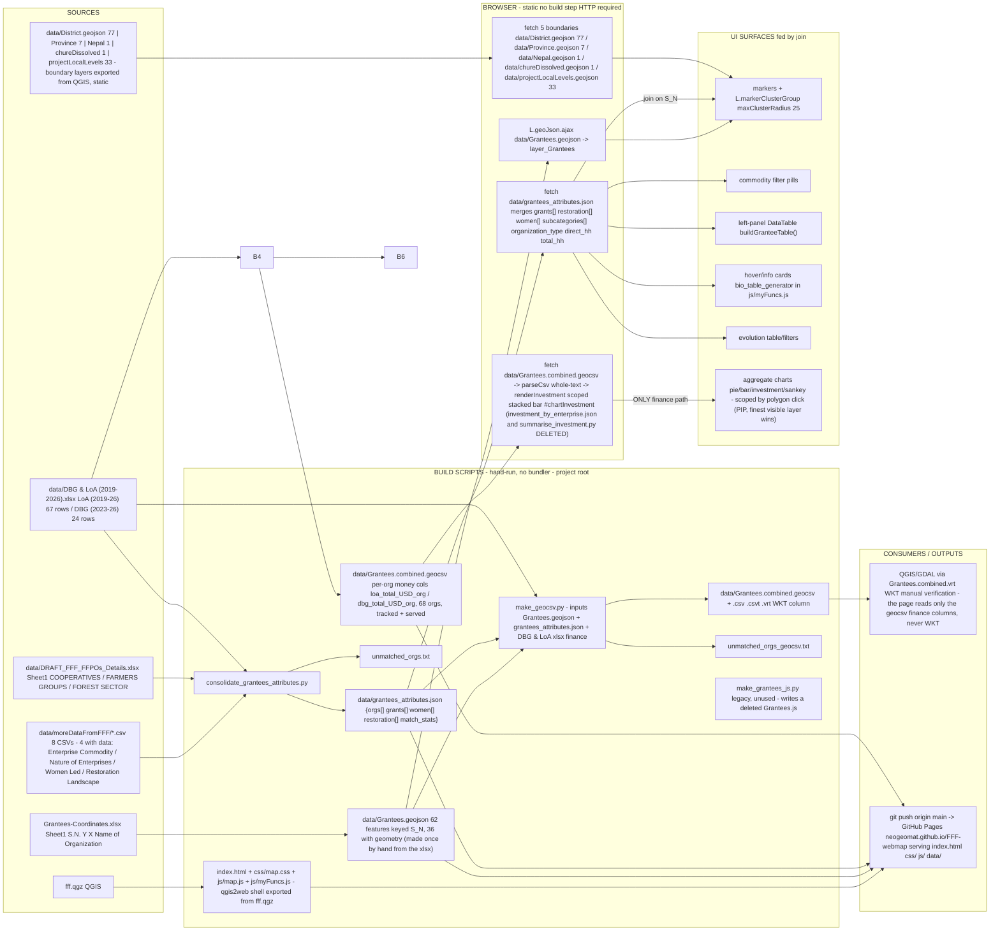

# FFF Webmap — Data Flow

```mermaid
---
theme:light
---
flowchart LR

subgraph SRC["SOURCES"]
  S1["Grantees-Coordinates.xlsx Sheet1 S.N. Y X Name of Organization"]
  S2["data/moreDataFromFFF/*.csv 8 CSVs - 4 with data: Enterprise Commodity / Nature of Enterprises / Women Led / Restoration Landscape"]
  S3["data/DRAFT_FFF_FFPOs_Details.xlsx Sheet1 COOPERATIVES / FARMERS GROUPS / FOREST SECTOR"]
  S4["data/DBG & LoA (2019-2026).xlsx LoA (2019-26) 67 rows / DBG (2023-26) 24 rows"]
  S5["fff.qgz QGIS"]
  S6["data/District.geojson 77 | Province 7 | Nepal 1 | chureDissolved 1 | projectLocalLevels 33 - boundary layers exported from QGIS, static"]
end

subgraph BLD["BUILD SCRIPTS - hand-run, no bundler - project root"]
  G1["data/Grantees.geojson 62 features keyed S_N, 36 with geometry (made once by hand from the xlsx)"]
  SH["index.html + css/map.css + js/map.js + js/myFuncs.js - qgis2web shell exported from fff.qgz"]
  B1["consolidate_grantees_attributes.py"]
  B2["data/grantees_attributes.json {orgs[] grants[] women[] restoration[] match_stats}"]
  B3["unmatched_orgs.txt"]
  B5["data/Grantees.combined.geocsv per-org money cols loa_total_USD_org / dbg_total_USD_org, 68 orgs, tracked + served"]
  B7["make_geocsv.py - inputs Grantees.geojson + grantees_attributes.json + DBG & LoA xlsx finance"]
  B8["data/Grantees.combined.geocsv + .csv .csvt .vrt WKT column"]
  B9["unmatched_orgs_geocsv.txt"]
  B10["make_grantees_js.py legacy, unused - writes a deleted Grantees.js"]
end

subgraph BRW["BROWSER - static no build step HTTP required"]
  R1["L.geoJson.ajax data/Grantees.geojson -> layer_Grantees"]
  R2["fetch data/grantees_attributes.json merges grants[] restoration[] women[] subcategories[] organization_type direct_hh total_hh"]
  R3["fetch data/Grantees.combined.geocsv -> parseCsv whole-text -> renderInvestment scoped stacked bar #chartInvestment (investment_by_enterprise.json and summarise_investment.py DELETED)"]
  R4["fetch 5 boundaries data/District.geojson 77 / data/Province.geojson 7 / data/Nepal.geojson 1 / data/chureDissolved.geojson 1 / data/projectLocalLevels.geojson 33"]
end

subgraph UI["UI SURFACES fed by join"]
  U1["markers + L.markerClusterGroup maxClusterRadius 25"]
  U2["commodity filter pills"]
  U3["left-panel DataTable buildGranteeTable()"]
  U4["hover/info cards bio_table_generator in js/myFuncs.js"]
  U5["evolution table/filters"]
  U6["aggregate charts pie/bar/investment/sankey - scoped by polygon click (PIP, finest visible layer wins)"]
end

subgraph OUT["CONSUMERS / OUTPUTS"]
  O1["QGIS/GDAL via Grantees.combined.vrt WKT manual verification - the page reads only the geocsv finance columns, never WKT"]
  O2["git push origin main -> GitHub Pages neogeomat.github.io/FFF-webmap serving index.html css/ js/ data/"]
end

S1 --> G1
S5 --> SH
S2 --> B1
S3 --> B1
S4 --> B1
S4 --> B4
B1 --> B2
B1 --> B3
B4 --> B5
B4 --> B6
G1 --> B7
B2 --> B7
S4 --> B7
B7 --> B8
B7 --> B9
S6 --> R4
G1 --> R1
B2 --> R2
B5 --> R3
R1 --> U1
R2 -- join on S_N --> U1
R2 --> U2
R2 --> U3
R2 --> U4
R2 --> U5
R3 -- ONLY finance path --> U6
R4 --> U1
B8 --> O1
SH --> O2
G1 --> O2
B2 --> O2
B5 --> O2
```
