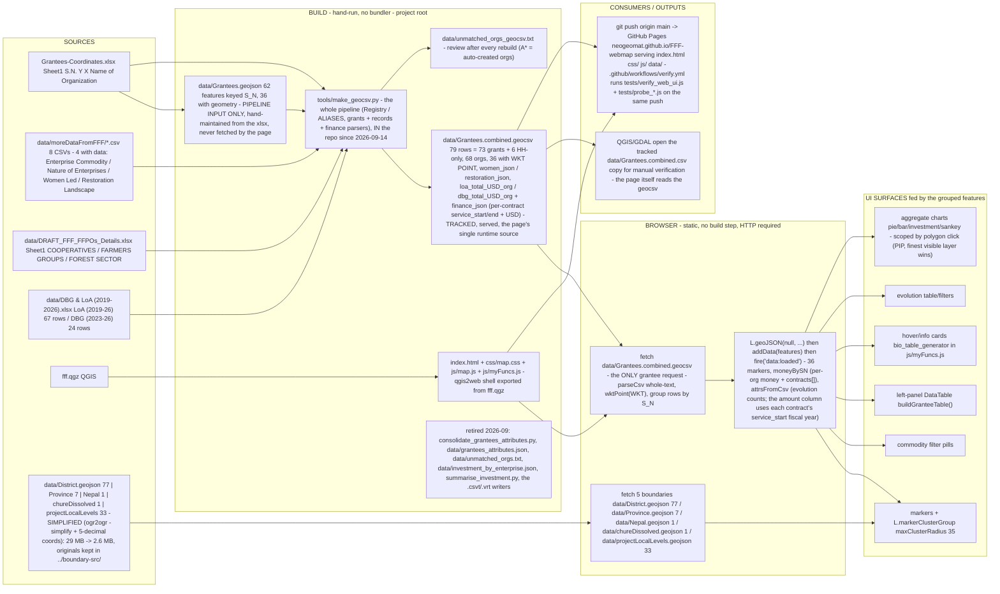

# FFF Webmap — Data Flow

## Notes

- **One request, one file.** The browser fetches the geocsv once and groups the rows by `S_N` in JS: org
  properties, `grants[]`, `women[]`/`restoration[]` (the `*_json` columns), per-org LoA/DBG USD, and the
  `WKT` point. `data/Grantees.geojson` is an input to `make_geocsv.py`, not something the page loads.
  `probe_geocsv_source.js` asserts both retired files are never requested.
- **Money.** National totals count every org in the file (68, including coordinate-less orgs):
  2,288,256 USD = Integrated 916,886 + Forest-based 336,226 + Farm-based 195,089. A polygon scope counts only
  the markers inside it, so a district figure is legitimately smaller.
- **Parse the CSV as one string.** Cells contain newlines and commas inside quotes; a line-based split drops
  2 rows / ~73,014 USD. `parseCsv()` in `js/map.js` walks the whole text with a quote flag and skips CR.
- **Records.** 22 women / 61 restoration records ride the geocsv. The retired `grantees_attributes.json` had
  23 / 70 across 77 orgs; the extra 10 belong to synthetic `A7–A15` orgs that appear only in the
  women/restoration CSVs and so have no row (no coordinates, no grant) — nothing rendered loses data.
- **Rebuild after any source edit:** `cd Webmap && python3 tools/make_geocsv.py`, then review
  `data/unmatched_orgs_geocsv.txt`, then `node tests/probe_geocsv_source.js` (see `tests/README`; the whole suite
  is `for f in tests/verify_web_ui.js tests/probe_*.js; do node $f || echo FAILED $f; done`).
- **Boundaries are simplified, not raw.** `ogr2ogr -simplify` (District 0.0002°, Province/Nepal/Chure 0.0005°,
  Local Level 0.0001°) + `COORDINATE_PRECISION=5` cut 29 MB to 2.6 MB: the page went from 30.1 MB / 1.6 s to
  4.4 MB / 0.8 s to first markers. The unsimplified originals live in the unversioned `../boundary-src/`; after
  any boundary rebuild run `python3 tests/boundary_pip_check.py data/District.geojson` (it fails if a pin moved
  to another district).
